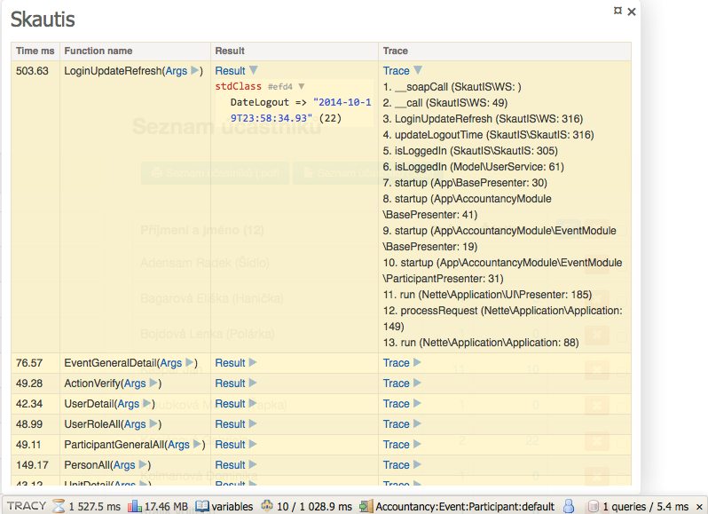

# Konfigurace rozšíření

```neon
extensions:
    skautis: Skaut\SkautisNette\SkautisExtension

skautis:
    applicationId: abcd-...-abcd   # povinné, AppId přidělené administrátorem skautISu
    testMode: true                 # povinné, true = test-is.skaut.cz, false = ostrý is.skaut.cz
    cache: true                    # cachovat WSDL
    compression: true              # komprimovat SOAP požadavky
    profiler: null                 # Tracy panel; null = podle debug režimu
    fixtures: null                 # adresář s JSON fixturami; když je nastavený, skautIS se nevolá
```


## Testovací režim

`testMode` nemá výchozí hodnotu. `true` přepne knihovnu na https://test-is.skaut.cz/, `false` na ostrý
https://is.skaut.cz/. Konfigurace bez této volby neprojde kompilací kontejneru, takže se aplikace nemůže omylem
připojit k jiné instanci skautISu, než jste chtěli.


## Cachování WSDL souboru

Volbou `cache: false` je možné vypnout cachování WSDL souboru. Pokud k tomu nemáte závažný důvod, doporučujeme
cachování ponechat zapnuté.


## Komprese požadavků

Volbou `compression: false` je možné vypnout kompresi při provádění požadavků na skautIS. Pokud k tomu nemáte
závažný důvod, doporučujeme kompresi ponechat zapnutou.


## Profiler

S nainstalovanou [Tracy](https://tracy.nette.org) se v debug režimu automaticky aktivuje panel se všemi dotazy na
skautIS v aktuálním požadavku (metoda, argumenty, výsledek, doba trvání, trace). Neúspěšné dotazy jsou zvýrazněné.



`profiler: false` panel vypne i v debug režimu, `profiler: true` ho zapne i mimo něj.


## Registrované služby

| Služba | Typ |
|---|---|
| `skautis.skautis` | `Skaut\Skautis\Skautis` |
| `skautis.user` | `Skaut\Skautis\User` |
| `skautis.config` | `Skaut\Skautis\Config` |
| `skautis.wsdlManager` | `Skaut\Skautis\Wsdl\WsdlManager` |
| `skautis.webServiceFactory` | `Skaut\Skautis\Wsdl\WebServiceFactoryInterface` |
| `skautis.session` | `Skaut\SkautisNette\SessionAdapter` |
| `skautis.eventDispatcher` | `Skaut\SkautisNette\EventDispatcher` |
| `skautis.queryLog`, `skautis.panel` | jen s Tracy a zapnutým profilerem, bez autowiringu |

Služby jsou autowirované podle typu, v presenteru nebo službě stačí `Skaut\Skautis\Skautis $skautis`.


## Posluchači událostí

Knihovna oznamuje každé SOAP volání PSR-14 událostmi `Skaut\Skautis\Wsdl\Event\RequestPreEvent`,
`RequestPostEvent` a `RequestFailEvent`. Továrna knihovny přijme jen jeden dispatcher, proto ho rozšíření
registruje samo (`Skaut\SkautisNette\EventDispatcher`) a vlastní posluchače se přidávají k němu:

```neon
services:
    skautisLogger: App\SkautisLogger

decorator:
    Skaut\SkautisNette\EventDispatcher:
        setup:
            - addListener(@skautisLogger)
```

```php
use Skaut\Skautis\Wsdl\Event\RequestFailEvent;
use Skaut\Skautis\Wsdl\Event\RequestPostEvent;

final class SkautisLogger
{
    public function __invoke(object $event): void
    {
        if ($event instanceof RequestPostEvent) {
            // $event->getFname(), $event->getArgs(), $event->getDuration(), $event->getResult()
        } elseif ($event instanceof RequestFailEvent) {
            // $event->getExceptionClass(), $event->getExceptionString()
        }
    }
}
```

Posluchač je libovolný `callable(object): void`. S nastavenými `fixtures` se události nevyvolávají.


## Session

`Skaut\SkautisNette\SessionAdapter` ukládá přihlašovací data do sekce Nette session pojmenované
`Skaut\SkautisNette\SessionAdapter`. Do verze 3.0 se sekce jmenovala `Skautis\Nette\SessionAdapter`, po přechodu
se proto uživatelé jednou odhlásí. Knihovna 3.1 v session drží `DateTimeImmutable`; starší data s `DateTime` ignoruje.
